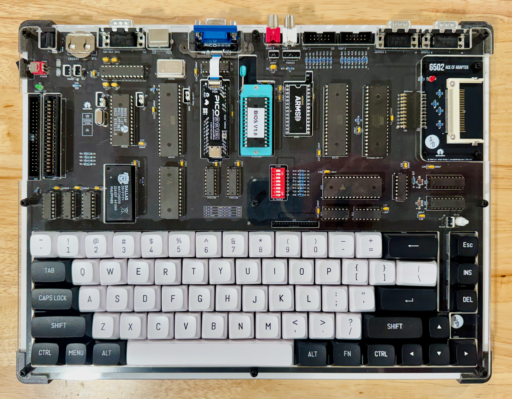

6502-ACE
========

<!--  -->

An **AC6502** retro-style 8-bit computer based on the **65C02** microprocessor.

---

## Table of Contents

- [Overview](#overview)
- [Architecture](#architecture)
- [Systems](#systems)
- [Software](#software)
- [Hardware](#hardware)
  - [ACE Board](#ace-board)
    - [Revision History](#revision-history)
  - [ACE CF Adapter](#ace-cf-adapter)
- [Firmware](#firmware)
  - [AB Controller](#ab-controller)
- [CAD](#cad)
- [Production](#production)
- [Schematics](#schematics)
- [Libraries](#libraries)
- [Bill of Materials](#bill-of-materials)
  - [ACE Board](#ace-board-1)
  - [ACE CF Adapter](#ace-cf-adapter-1)
- [License](#license)

---

## Overview

The AC6502 ecosystem is a family of open-source, 65C02-based computers sharing a common architecture, memory map, and [BIOS](https://github.com/acwright/6502-BIOS). Each computer in the family is purpose-built for a different use case but runs the same software and firmware.

The **ACE** (All-in-one Computer Experience) is a complete, self-contained 65C02 computer on a single PCB. It integrates everything found across the COB's modular cards — CPU, memory, video, audio, storage, serial, GPIO, RTC, and keyboard controller — onto one board, delivering the full experience without a backplane or expansion cards.

## Architecture

All AC6502 computers share:

- **CPU**: 65C02 (or accurate emulation)
- **Memory**: 32KB RAM + 32KB ROM, with optional banked RAM expansion
- **Memory Map**: Standardized across the ecosystem — zero page, stack, I/O space ($8000–$9FFF), system ROM, and interrupt vectors at $FFFA–$FFFF
- **Bus**: 16-bit address bus, 8-bit bidirectional data bus, standard 65C02 control signals (RW, PHI2, RESET, IRQ, NMI, RDY, SYNC)
- **BIOS**: A common [BIOS](https://github.com/acwright/6502-BIOS) provides the kernel, monitor, and BASIC interpreter across all systems

## Systems

| Project | Description |
|---------|-------------|
| [6502-ACE](https://github.com/acwright/6502-ACE) | All-in-one Computer Experience — A single board computer (YOU ARE HERE) |
| [6502-COB](https://github.com/acwright/6502-COB) | Computer On a Backplane — Modular desktop computer with expandable card slots |
| [6502-DEV](https://github.com/acwright/6502-DEV) | Development Environment Vehicle — Emulation-based dev system |
| [6502-KIM](https://github.com/acwright/6502-KIM) | Keypad Input Monitor - KIM-1 inspired minimal computer |
| [6502-VCS](https://github.com/acwright/6502-VCS) | Video Computer System — Cartridge-based retro gaming console |

## Software

| Project | Description |
|---------|-------------|
| [6502-BIOS](https://github.com/acwright/6502-BIOS) | The shared BIOS (kernel, monitor, BASIC) for all AC6502 computers |
| [6502-PRG](https://github.com/acwright/6502-PRG) | Template project for writing assembly language programs |
| [6502-CRT](https://github.com/acwright/6502-CRT) | Template project for writing assembly language cartridges |
| [6502-EMULATOR](https://github.com/acwright/6502-EMULATOR) | Node.js-based AC6502 emulator |
| [6502-WEBULATOR](https://github.com/acwright/6502-WEBULATOR) | Web-based AC6502 emulator |

## Hardware

This repository contains KiCad 7.0+ PCB designs for the ACE board.

### ACE Board
`Hardware/ACE Board/`

The single integrated board hosting the W65C02S CPU and all peripherals. Provides:

- **CPU**: W65C02S running at 1 MHz
- **RAM**: 32KB SRAM (62256) + Optional 512K banked SRAM (AS6C4008)
- **ROM**: 32KB EEPROM (28C256)
- **Video**: Pico9918 (VGA 640×480)
- **Audio**: ARMSID SID chip emulator (3-voice synthesis, RCA output)
- **Storage**: Storage adapter socket
- **Serial**: 65C51 ACIA with MAX238 level shifter (RS-232 via DB9, 50–19200 baud)
- **GPIO**: 65C22 VIA (20 GPIO pins, 2× 16-bit timers, shift register)
- **RTC**: DS1511Y real-time clock with battery-backed NVRAM
- **Keyboard Controller**: ATmega1284P running AB Controller firmware
- **Input**: PS/2 keyboard connector and 8×8 keyboard matrix header
- **Joystick**: Atari 2600-compatible joystick port
- **Clock**: On-board oscillator (1–8 MHz, selectable by swapping oscillator)
- **Reset**: Power-on RC reset circuit and manual reset button
- **Power**: 5V DC, 2–3A

#### Revision History

**Rev 1.1**

- Fixes the gating of the `LOADL` and `LOADH` latch-enable signals for the 74HC573 latches (`U21`, `U22`) that drive the AS6C4008 banked SRAM. In Rev 1.0 the final two decode gates (`U13C`/`U13D`) were NANDs, which left the latches pulsing while idle and allowed spurious loads on reads, so the latches never reliably held a bank value.
- The fix replaces the final NAND stage with a NOR function: `LOADL = NOR(SEL_L, WB)` and `LOADH = NOR(SEH_L, WB)`, holding each latch enable low out of window and only pulsing on an in-window write. This makes banked RAM work correctly with no firmware change.
- Implemented by adding one 74HC02 quad NOR (`U23`). The existing select logic in `U13A`/`U13B` is unchanged.

**Rev 1.0**

- Initial release.

### ACE CF Adapter
`Hardware/ACE CF Adapter/`

A CompactFlash adapter board that connects to the Storage header on the ACE Board. Provides:

- **Interface**: 8-bit IDE mode
- **Storage**: CompactFlash socket (up to 1MB)

## Firmware

This repository contains [PlatformIO](https://platformio.org/)-based firmware for the ACE board.

### AB Controller
`Firmware/AB Controller/`

Firmware for the ATmega1284P keyboard controller on the ACE board. Provides:

- Dual keyboard input: PS/2 and 8×8 matrix keyboard simultaneously
- PS/2 scancode to ASCII conversion
- Matrix keyboard scanning with hardware debouncing
- Modifier key support: Shift (symbols/punctuation) and Ctrl (control codes)
- Buffered output via 65C22 VIA with CA1/CB1 data-ready strobes
- Independent enable/disable for PS/2 and matrix inputs

See [Firmware/AB Controller/README.md](./Firmware/AB%20Controller/README.md) for setup and usage instructions.

## CAD
`CAD/`

3D-printable enclosure bases and laser-cut top panels for the ACE system.

## Production
`Production/`

JLCPCB-ready Gerber files and BOM/CPL for PCB fabrication and assembly.

## Schematics
`Schematics/`

PDF schematics for the ACE board.

## Libraries
`Libraries/`

Shared KiCad symbol and footprint libraries used across all AC6502 hardware projects.

## Bill of Materials

### ACE Board

| Reference | Qty | Value | Description | DigiKey | Mouser | Other |
|-----------|-----|-------|-------------|---------|--------|-------|
| BT1 | 1 | CR2032 | Battery Holder | [BAT-HLD-001-THM-ND](https://www.digikey.com/en/products/filter?keywords=BAT-HLD-001-THM-ND) | [712-BAT-HLD-001-THM](https://www.mouser.com/ProductDetail/712-BAT-HLD-001-THM) | |
| C1, C9–C30 | 23 | 100nF | Disc Capacitor | [478-5732-ND](https://www.digikey.com/en/products/filter?keywords=478-5732-ND) | | [AMAZON](https://www.amazon.com/PANMILED-Multilayer-Monolithic-Capacitors-Assortment/dp/B0CYQ1Z4G5) |
| C2, C3, C5, C6, C8 | 5 | 1µF | Disc Capacitor | [478-7667-ND](https://www.digikey.com/en/products/filter?keywords=478-7667-ND) | | [AMAZON](https://www.amazon.com/PANMILED-Multilayer-Monolithic-Capacitors-Assortment/dp/B0CYQ1Z4G5) |
| C4, C7 | 2 | 2.2nF | Disc Capacitor | [478-SR151C222KAATR1CT-ND](https://www.digikey.com/en/products/filter?keywords=478-SR151C222KAATR1CT-ND) | | [AMAZON](https://www.amazon.com/PANMILED-Multilayer-Monolithic-Capacitors-Assortment/dp/B0CYQ1Z4G5) |
| C31 | 1 | 10uF | Electrolytic Capacitor 16v | [P966-ND](https://www.digikey.com/en/products/filter?keywords=P966-ND) | | [AMAZON](https://www.amazon.com/Tnisesm-Electrolytic-Capacitor-Assortment-Capacitors/dp/B0G5X62C69) |
| D1 | 1 | LED | 3.0mm Power LED | [732-5008-ND](https://www.digikey.com/en/products/filter?keywords=732-5008-ND) | | [AMAZON](https://www.amazon.com/300-Pcs-LED-Diode-Assortment/dp/B0F38LJDJB) |
| D2, D3 | 2 | BAT85 | Schottky Diode | [BAT85SCT-ND](https://www.digikey.com/en/products/filter?keywords=BAT85SCT-ND) | [78-BAT85S](https://www.mouser.com/ProductDetail/78-BAT85S) | [AMAZON](https://www.amazon.com/gp/product/B0CKSNPVH8) |
| J1 | 1 | PHI2 SELECT | Pin Header 1×3 2.54mm | | | [AMAZON](https://www.amazon.com/Straight-Breakaway-Connector-Breadboard-Electronic/dp/B0FRZW75VS) |
| J2 | 1 | CTS EN | Pin Header 1×3 2.54mm | | | [AMAZON](https://www.amazon.com/Straight-Breakaway-Connector-Breadboard-Electronic/dp/B0FRZW75VS) |
| J3 | 1 | RESET SW | Pin Header 1×2 2.54mm | | | [AMAZON](https://www.amazon.com/Straight-Breakaway-Connector-Breadboard-Electronic/dp/B0FRZW75VS) |
| J4 | 1 | DCD EN | Pin Header 1×3 2.54mm | | | [AMAZON](https://www.amazon.com/Straight-Breakaway-Connector-Breadboard-Electronic/dp/B0FRZW75VS) |
| J5 | 1 | VDD | Pin Header 1×2 2.54mm | | | [AMAZON](https://www.amazon.com/Straight-Breakaway-Connector-Breadboard-Electronic/dp/B0FRZW75VS) |
| J6 | 1 | JOYSTICK A | DB-9 Male | [609-1481-ND](https://www.digikey.com/en/products/filter?keywords=609-1481-ND) | [649-D09P33E4GX00LF](https://www.mouser.com/ProductDetail/649-D09P33E4GX00LF) | |
| J7 | 1 | PADDLES | Pin Header 1×4 2.54mm | | | [AMAZON](https://www.amazon.com/Straight-Breakaway-Connector-Breadboard-Electronic/dp/B0FRZW75VS) |
| J8 | 1 | JOYSTICK B | DB-9 Male | [609-1481-ND](https://www.digikey.com/en/products/filter?keywords=609-1481-ND) | [649-D09P33E4GX00LF](https://www.mouser.com/ProductDetail/649-D09P33E4GX00LF) | |
| J9 | 1 | PORT B | Box Header 2×6 2.54mm | [2057-BHR-12-VUA-ND](https://www.digikey.com/en/products/filter?keywords=2057-BHR-12-VUA-ND) | | [AMAZON](https://www.amazon.com/uxcell-2-54mm-2x6-Pin-Straight-Connector/dp/B07DJYVZV2) |
| J10 | 1 | PORT A | Box Header 2×6 2.54mm | [2057-BHR-12-VUA-ND](https://www.digikey.com/en/products/filter?keywords=2057-BHR-12-VUA-ND) | | [AMAZON](https://www.amazon.com/uxcell-2-54mm-2x6-Pin-Straight-Connector/dp/B07DJYVZV2) |
| J11 | 1 | AUDIO L | RCA Jack | [PJRAN1X1U02X-ND](https://www.digikey.com/en/products/filter?keywords=PJRAN1X1U02X-ND) | [502-PJRAN1X1U02X](https://www.mouser.com/ProductDetail/502-PJRAN1X1U02X) | |
| J12 | 1 | DB9 MALE (DTE) | DB-9 Male | [609-1481-ND](https://www.digikey.com/en/products/filter?keywords=609-1481-ND) | [649-D09P33E4GX00LF](https://www.mouser.com/ProductDetail/649-D09P33E4GX00LF) | |
| J13 | 1 | PS/2 | 6-pin Mini-DIN | | [806-KMDGX-6S-BS](https://www.mouser.com/ProductDetail/806-KMDGX-6S-BS) | [AMAZON](https://www.amazon.com/dp/B08GS3QL7T) |
| J14 | 1 | AUDIO R | RCA Jack | [PJRAN1X1U03X-ND](https://www.digikey.com/en/products/filter?keywords=PJRAN1X1U03X-ND) | [502-PJRAN1X1U03X](https://www.mouser.com/ProductDetail/502-PJRAN1X1U03X) | |
| J15 | 1 | AUDIO | Pin Header 1×2 2.54mm | | | [AMAZON](https://www.amazon.com/Straight-Breakaway-Connector-Breadboard-Electronic/dp/B0FRZW75VS) |
| J16 | 1 | 5V DC | DC Barrel Jack | [2073-DCJ200-10-A-K1-K-ND](https://www.digikey.com/en/products/filter?keywords=2073-DCJ200-10-A-K1-K-ND) | [640-DCJ200-10-A-K1-K](https://www.mouser.com/ProductDetail/640-DCJ200-10-A-K1-K) | |
| J17 | 1 | CART | Card Edge 2×20 2.54mm | [A31723-ND](https://www.digikey.com/en/products/filter?keywords=A31723-ND) | [571-5-5530843-4](https://www.mouser.com/ProductDetail/571-5-5530843-4) | |
| J18 | 1 | BUS | Box Header 2×20 2.54mm | | | [AMAZON](https://www.amazon.com/Female-Headers-Connector-Header-Raspberry/dp/B07DNHS2SJ) |
| J19 | 1 | VCC | Pin Header 1×2 2.54mm | | | [AMAZON](https://www.amazon.com/Straight-Breakaway-Connector-Breadboard-Electronic/dp/B0FRZW75VS) |
| J20 | 1 | POWER LED | Pin Header 1×2 2.54mm | | | [AMAZON](https://www.amazon.com/Straight-Breakaway-Connector-Breadboard-Electronic/dp/B0FRZW75VS) |
| J21 | 1 | STORAGE | Pin Socket 2×10 2.54mm Horiz | [S5563-ND](https://www.digikey.com/en/products/filter?keywords=S5563-ND) | | |
| J22 | 1 | KEYBOARD | Pin Header 1×16 2.00mm | | | [AMAZON](https://www.amazon.com/Straight-Breakaway-Connector-Breadboard-Electronic/dp/B0FRZW75VS) |
| R1–R5, R7–R14, R16–R23, R27 | 22 | 10kΩ | 1/8W Resistor | [RNF18FTD10K0CT-ND](https://www.digikey.com/en/products/filter?keywords=RNF18FTD10K0CT-ND) | | [AMAZON](https://www.amazon.com/ALLECIN-8W-Metal-Film-Resistor/dp/B0C77TM3NR) |
| R6, R24, R25, R28–R36 | 12 | 1kΩ | 1/8W Resistor | [RNF18FTD1K00CT-ND](https://www.digikey.com/en/products/filter?keywords=RNF18FTD1K00CT-ND) | | [AMAZON](https://www.amazon.com/ALLECIN-8W-Metal-Film-Resistor/dp/B0C77TM3NR) |
| R26 | 1 | 330Ω | 1/8W Resistor | | | [AMAZON](https://www.amazon.com/ALLECIN-8W-Metal-Film-Resistor/dp/B0C77TM3NR) |
| SW1–SW13, SW15, SW17–SW28, SW30, SW32–SW40, SW42–SW43, SW45–SW48, SW50–SW57, SW60, SW63–SW65 | 54 | Various | Cherry MX Switch 1.00u | [CH196-ND](https://www.digikey.com/en/products/filter?keywords=CH196-ND) | | [AMAZON](https://www.amazon.com/dp/B0FYR5TV3X) |
| SW58, SW59, SW62, SW66, SW67 | 5 | CTRL / ALT / FN | Cherry MX Switch 1.25u | [CH196-ND](https://www.digikey.com/en/products/filter?keywords=CH196-ND) | | [AMAZON](https://www.amazon.com/dp/B0FYR5TV3X) |
| SW16, SW29 | 2 | TAB / Backslash | Cherry MX Switch 1.50u | [CH196-ND](https://www.digikey.com/en/products/filter?keywords=CH196-ND) | | [AMAZON](https://www.amazon.com/dp/B0FYR5TV3X) |
| SW31 | 1 | CAPS LOCK | Cherry MX Switch 1.75u | [CH196-ND](https://www.digikey.com/en/products/filter?keywords=CH196-ND) | | [AMAZON](https://www.amazon.com/dp/B0FYR5TV3X) |
| SW14 | 1 | BACKSPACE | Cherry MX Switch 2.00u | [CH196-ND](https://www.digikey.com/en/products/filter?keywords=CH196-ND) | | [AMAZON](https://www.amazon.com/dp/B0FYR5TV3X) |
| SW41, SW44, SW49 | 3 | SHIFT / ENTER | Cherry MX Switch 2.25u | [CH196-ND](https://www.digikey.com/en/products/filter?keywords=CH196-ND) | | [AMAZON](https://www.amazon.com/dp/B0FYR5TV3X) |
| SW61 | 1 | SPACE | Cherry MX Switch 6.25u | [CH196-ND](https://www.digikey.com/en/products/filter?keywords=CH196-ND) | | [AMAZON](https://www.amazon.com/dp/B0FYR5TV3X) |
| SW68 | 1 | POWER | SPDT Switch | [EG4326-ND](https://www.digikey.com/en/products/filter?keywords=EG4326-ND) | [612-400MSP1R6BLKM6QE](https://www.mouser.com/ProductDetail/612-400MSP1R6BLKM6QE) | |
| SW69 | 1 | IO ENABLE | 8× DIP Switch SPST | | | [AMAZON](https://www.amazon.com/Yohii-2-54mm-Positions-Double-Assorted/dp/B07DSBX4BK/) |
| SW70 | 1 | RESET | Tact Push Button 5mm | | | [AMAZON](https://www.amazon.com/QTEATAK-Momentary-Tactile-Button-Switch/dp/B07VSNN9S2) |
| U1 | 1 | W65C02S | 65C02 CPU | | [955-W65C02S6TPG-14](https://www.mouser.com/ProductDetail/955-W65C02S6TPG-14) | |
| U2 | 1 | W65C22 | 65C22 VIA | | [955-W65C22N6TPG-14](https://www.mouser.com/ProductDetail/955-W65C22N6TPG-14) | |
| U3 | 1 | Pico9918A | VDP (VGA) | | | [TINDIE](https://www.tindie.com/products/visrealm/pico9918-pro/) |
| U4 | 1 | 65C51 | ACIA | | | [JAMECO](https://www.jameco.com/z/R6551AP-Rockwell-IC-6551-Asynchronous-Communication-Interface-Adapter-DIP-28-pin_43318.html) |
| U5 | 1 | 74HC163 | 4-bit Counter | [296-8246-5-ND](https://www.digikey.com/en/products/filter?keywords=296-8246-5-ND) | [595-SN74HC163N](https://www.mouser.com/ProductDetail/595-SN74HC163N) | |
| U6 | 1 | ATmega1284-P | Keyboard Controller MCU | [ATMEGA1284-PU-ND](https://www.digikey.com/en/products/filter?keywords=ATMEGA1284-PU-ND) | [556-ATMEGA1284-PU](https://www.mouser.com/ProductDetail/556-ATMEGA1284-PU) | |
| U7 | 1 | AS6C62256 | 32KB SRAM | [1450-1033-ND](https://www.digikey.com/en/products/filter?keywords=1450-1033-ND) | [913-AS6C62256-55PCN](https://www.mouser.com/ProductDetail/913-AS6C62256-55PCN) | |
| U8 | 1 | AT28C256 | 32KB EEPROM | [AT28C256-15PU-ND](https://www.digikey.com/en/products/filter?keywords=AT28C256-15PU-ND) | [556-AT28C25615PU](https://www.mouser.com/ProductDetail/556-AT28C25615PU) | |
| U9 | 1 | 6581 | SID Chip | | | [LINK](https://retrocomp.cz/produkt?id=2) |
| U10 | 1 | MAX238xNG+ | RS-232 Transceiver | [MAX238CNG+-ND](https://www.digikey.com/en/products/filter?keywords=MAX238CNG+-ND) | [700-MAX238CNG](https://www.mouser.com/ProductDetail/700-MAX238CNG) | |
| U11–U14, U16 | 5 | 74HC00 | Quad NAND | [296-1563-5-ND](https://www.digikey.com/en/products/filter?keywords=296-1563-5-ND) | [595-SN74HC00N](https://www.mouser.com/ProductDetail/595-SN74HC00N) | |
| U15 | 1 | AS6C4008 | 512KB SRAM | [1450-1027-ND](https://www.digikey.com/en/products/filter?keywords=1450-1027-ND) | [913-AS6C4008-55PCN](https://www.mouser.com/ProductDetail/913-AS6C4008-55PCN) | |
| U17 | 1 | 74HC30 | 8-input NAND | [296-9196-5-ND](https://www.digikey.com/en/products/filter?keywords=296-9196-5-ND) | [595-CD74HC30E](https://www.mouser.com/ProductDetail/595-CD74HC30E) | |
| U18 | 1 | DS1511Y | RTC + NVRAM | [DS1511Y+-ND](https://www.digikey.com/en/products/filter?keywords=DS1511Y+-ND) | [700-DS1511Y](https://www.mouser.com/ProductDetail/700-DS1511Y) | |
| U19, U20 | 2 | 74HC138 | 3-to-8 Decoder | [296-1575-5-ND](https://www.digikey.com/en/products/filter?keywords=296-1575-5-ND) | [595-SN74HC138N](https://www.mouser.com/ProductDetail/595-SN74HC138N) | |
| U21, U22 | 2 | 74HC573 | Octal Latch | [296-12815-5-ND](https://www.digikey.com/en/products/filter?keywords=296-12815-5-ND) | [595-CD74HC573EE4](https://www.mouser.com/ProductDetail/595-CD74HC573EE4) | |
| U23 | 1 | 74HC02 | Quad NOR | [296-1565-5-ND](https://www.digikey.com/en/products/filter?keywords=296-1565-5-ND) | [595-SN74HC02N](https://www.mouser.com/ProductDetail/595-SN74HC02N) | |
| X1 | 1 | 16MHz | DIP-14 Oscillator | [X947-ND](https://www.digikey.com/en/products/filter?keywords=X947-ND) | [815-ACO-16-EK](https://www.mouser.com/ProductDetail/815-ACO-16-EK) | |
| Y1 | 1 | 1.8432MHz | Crystal | [3155-1.8432M20P2/49U-ND](https://www.digikey.com/en/products/filter?keywords=3155-1.8432M20P2%2F49U-ND) | [815-AB-1.8432-B2](https://www.mouser.com/ProductDetail/815-AB-1.8432-B2) | |

### ACE CF Adapter

| Reference | Qty | Value | Description | DigiKey | Mouser | Other |
|-----------|-----|-------|-------------|---------|--------|-------|
| D1 | 1 | ACT LED | 3.0mm LED | [732-5008-ND](https://www.digikey.com/en/products/filter?keywords=732-5008-ND) | | [AMAZON](https://www.amazon.com/300-Pcs-LED-Diode-Assortment/dp/B0F38LJDJB) |
| J1 | 1 | STORAGE | Pin Header 2×10 2.54mm Horiz | | | [AMAZON](https://www.amazon.com/dp/B00W8TSWXS) |
| J2 | 1 | Compact Flash | CF Socket | [4827-101D-TAAB-R01-ND](https://www.digikey.com/en/products/filter?keywords=4827-101D-TAAB-R01-ND) | | |
| R1–R4 | 4 | 1kΩ | 1/8W Resistor | [RNF18FTD1K00CT-ND](https://www.digikey.com/en/products/filter?keywords=RNF18FTD1K00CT-ND) | | [AMAZON](https://www.amazon.com/ALLECIN-8W-Metal-Film-Resistor/dp/B0C77TM3NR) |
| R5 | 1 | 330Ω | 1/8W Resistor | | | [AMAZON](https://www.amazon.com/ALLECIN-8W-Metal-Film-Resistor/dp/B0C77TM3NR) |

## License

Hardware designs are released under the [CERN Open Hardware Licence Version 2 – Permissive](https://ohwr.org/cern_ohl_p_v2.txt).  
Firmware is released under the [MIT License](./Firmware/ACE%20Controller/LICENSE).
